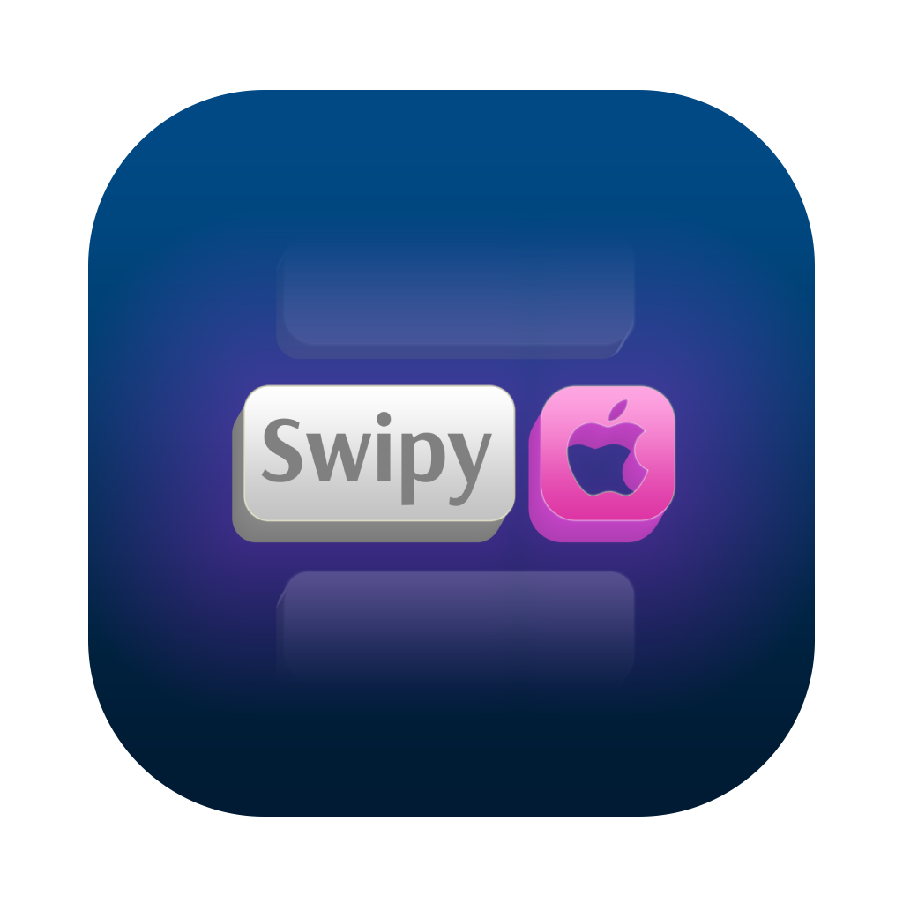

# Swipy

Swipy is a SwiftUI library for creating swipe actions. It allows you to easily add swipeable actions to your SwiftUI views, similar to the swipe actions in iOS Mail and other apps. 🥳

<p align="center">
    
</p>
<p align="center">
    Make swipe actions easily.
</p>
<p align="center">
    
</o>

## Why?

SwiftUI has swipe actions for only items in the built-in `List` view and `List` is unusable and extremely buggy when you want to make even a bit cute feature-rich UIs. 😞

First, after discovering that `List` is extremely buggy, I found a swipe actions library but it was not working in a `ScrollView` and then i decided to make `Swipy`. Swipy is clean and simple and tested on latest iOS SDK and Swift 6; it supports min **iOS 15** and **Swift 5**. 🥳

## Features

- Swipe to reveal actions
- Customizable
- Clean and simple API
- Easy integration with existing SwiftUI views
- UX friendly
- Can be used in a `ScrollView`

## iOS Support

Swipy supports minimum **iOS 15**.

> [!CAUTION]
> Swipy's `isSwipingAnItem` binding is useful with `ScrollView`'s `.scrollDisabled(_ disabled: Bool)` modifier but this modifier requires minimum **iOS 16**. However, you still have `isSwipingANItem` so, you can avoid scrolling if somehow it is `true`.

## Installation

### Swift Package Manager

You can install Swipy via Swift Package Manager.

#### Add Package Dependency on Xcode

1. In Xcode, **File > Add Package Dependencies**.
2. Enter Swipy GitHub repo address `https://github.com/rohanrhu/Swipy` into search bar.
3. Add Swipy to your project. 🥳

#### Add Package Dependency on `Package.swift`

Add Swipy as a dependency in your `Package.swift` file:

```swift
dependencies: [
    // ...
    .package(url: "https://github.com/rohanrhu/Swipy", from: "1.0.0")
]
```

### Or, Swipy is a single `Swipy.swift`

To use Swipy in your project, simply copy the `Swipy.swift` file into your project.

## Usage

Swipy is easy. It has two main views: `Swipy` and `SwipyAction`.

### Make Something Swipeable

In most cases, you'll want to make something swipeable in a `ScrollView`. First, you need to define a `isSwipingAnItem` state.

#### Defining `isSwipingAnItem`

We always need to have a `isSwipingAnItem` state and **bind** it to all `Swipy` sub-views.

> [!IMPORTANT]
> If your `Swipy` views are inside a `ScrollView` (or any kind of scrollables), your `Swipy` views will set your `isSwipingAnItem` state by bindings to make you able to disable/enable container's scroll properly.

```swift
@State private var isSwipingAnItem = false
```

and you'll use this for your `ScrollView`'s `.scrollDisabled(_ disabled: Bool)` modifier.

#### Making a View Swipeable

To make a view swipeable, you need to wrap it in a `Swipy` and provide the `isSwipingAnItem` binding.

```swift
Swipy(isSwipingAnItem: $isSwipingAnItem) {
    Text("Swipe me!")
}
```

### Adding Actions

You can add actions to a swipeable view by providing a closure that returns a view for each action.

```swift
Swipy(isSwipingAnItem: $isSwipingAnItem) {
    Text("Swipe me!")
} actions: {
    SwipyAction {
        Button {
            print("Delete")
        } label: {
            Image(systemName: "trash")
                .foregroundStyle(.white)
        }
    }
}
```

## Customizations

Swipy has customizations to make it fit your app's design and provide best user experience.

### View: `Swipy`

`Swipy` takes these arguments:

- `isSwipingAnItem`: A binding that indicates whether an item is being swiped.
- `content`: A closure that returns the view to be swiped.
- `actions`: A closure that returns a view for each action.
- (Optional) `swipeActionsMargin`: The margin for swipe actions, a `SwipyHorizontalMargin` struct.
- (Optional) `swipeThreshold`: The swipe threshold calculator function.
- (Optional) `swipeBehavior`: The behavior for swipe actions, a `SwipySwipeBehavior` struct.
- (Optional) `scrollBehavior`: The behavior for scroll actions, a `SwipyScrollBehavior` struct.

#### Option: `swipeActionsMargin: SwipyHorizontalMargin(leading: Double, trailing: Double)`

- `leading`: The margin on the leading side of the swipe actions.
- `trailing`: The margin on the trailing side of the swipe actions.

> [!NOTE]
> Default: `SwipyHorizontalMargin(leading: 0, trailing: 0)`

#### Option: `swipeThreshold: (SwipyModel) -> Double`

Function that calculates the swipe threshold. The function takes a `SwipyModel` and returns a `Double`.

You'll most likely want to use calculate the swipe threshold based on the width of the swipe actions view that is a property in the `SwipyModel`. (`\.swipeActionsWidth`)

> [!NOTE]
> Default: `\.swipeActionsWidth`

#### Option: `swipeBehavior: SwipySwipeBehavior`

The behavior for swipe actions. You can use predefined behaviors or create custom ones.

#### Option: `scrollBehavior: SwipyScrollBehavior`

The behavior for scroll actions. You can use predefined behaviors or create custom ones.

### View: `SwipyAction`

`SwipeAction` takes these arguments:

- `content`: A closure that returns the view for the action.

This view has no customizations. You can customize the action view as you like.

## Behaviors

Swipy provides customizable behaviors for both swipe and scroll actions. These behaviors can be passed to the `Swipy` view to control how swipe and scroll actions are handled.

> [!IMPORTANT]
> If you want to implement custom behaviors, it is simple but to avoid misunderstandings on **what they are**, please read the following carefully.

### Swipe Behavior

The `SwipySwipeBehavior` struct defines the behavior for swipe actions.

> [!IMPORTANT]
> Swipe behavior decider function is for **deciding to start or not to start swiping session**. Your swipe behavior must return `false` **to prevent to start swiping**.

You can use predefined behaviors or create custom ones.

> [!IMPORTANT]
> All the default behaviors ignores swipe behavior the current ongoing user drag session after it is started once until it ends; which means `.custom { model, gesture in !model.isSwiped && !model.isSwiping /* ... */ }`.

#### Predefined Swipe Behaviors

- `SwipySwipeBehavior.normal`: Default behavior.
- `SwipySwipeBehavior.soft`: Softer swipe behavior.
- `SwipySwipeBehavior.hard`: Harder swipe behavior.
- `SwipySwipeBehavior.straight`: No guard behavior.
- `SwipySwipeBehavior.disabled`: Disables swipe actions.
- `SwipySwipeBehavior.swiping()`: Behavior when an item is being swiped.
- `SwipySwipeBehavior.swiped()`: Behavior when an item is swiped.
- `SwipySwipeBehavior.offset(_ offset: Double)`: Behavior based on the swipe offset.
- `SwipySwipeBehavior.velocity(_ velocity: Double)`: Behavior based on the swipe velocity.

Example:

```swift
Swipy(
    isSwipingAnItem: $isSwipingAnItem,
    swipeBehavior: .normal
) {
    Text("Swipe me!")
} actions: {
    SwipyAction {
        Button {
            print("Delete")
        } label: {
            Image(systemName: "trash")
                .foregroundStyle(.white)
        }
    }
}
```

#### Combining Swipe Behaviors

You can combine swipe behaviors using the `and`, `or` and `not` methods.

Example:

```swift
Swipy(
    isSwipingAnItem: $isSwipingAnItem,
    swipeBehavior: .normal.and(.velocity(400)))
) {
    Text("Swipe me!")
} actions: {
    SwipyAction {
        Button {
            print("Delete")
        } label: {
            Image(systemName: "trash")
                .foregroundStyle(.white)
        }
    }
}
```

#### Custom Swipe Behavior

You can create custom swipe starter behaviors by providing a custom decider function.

Custom Example:

```swift
Swipy(
    isSwipingAnItem: $isSwipingAnItem,
    swipeBehavior: .custom { model, gesture in
        !model.isSwiped && !model.isSwiping && gesture.translation.width > -100
    }
) {
    Text("Swipe me!")
} actions: {
    SwipyAction {
        Button {
            print("Delete")
        } label: {
            Image(systemName: "trash")
                .foregroundStyle(.white)
        }
    }
}
```

High Velocity and Offset Example:

```swift
Swipy(
    isSwipingAnItem: $isSwipingAnItem,
    swipeBehavior: .custom().offset(200).and(.velocity(2000))
) {
    Text("Swipe me!")
} actions: {
    SwipyAction {
        Button {
            print("Delete")
        } label: {
            Image(systemName: "trash")
                .foregroundStyle(.white)
        }
    }
}
```

### Scroll Behavior

The `SwipyScrollBehavior` struct defines the behavior for **prevention of swiping when user is scrolling vertically.**

> [!IMPORTANT]
> Scroll behavior is a guard to prevent the container's vertical scroll while swiping. Your scroll behavior must return `true` for starting to prevent swiping for the current ongoing user drag session.

#### Predefined Scroll Behaviors

- `SwipyScrollBehavior.normal`: Default behavior.
- `SwipyScrollBehavior.soft`: Softer scroll behavior.
- `SwipyScrollBehavior.hard`: Harder scroll behavior.
- `SwipyScrollBehavior.disabled`: Disables scroll actions.

Example:

```swift
Swipy(
    isSwipingAnItem: $isSwipingAnItem,
    scrollBehavior: .normal
) {
    Text("Swipe me!")
} actions: {
    SwipyAction {
        Button {
            print("Delete")
        } label: {
            Image(systemName: "trash")
                .foregroundStyle(.white)
        }
    }
}
```

#### Custom Scroll Behavior

You can create custom scroll behaviors by providing a custom decider function.

Example:

```swift
Swipy(
    isSwipingAnItem: $isSwipingAnItem,
    scrollBehavior: .custom { model, gesture in
        !model.isSwiped && abs(gesture.translation.height) > 10
    }
) {
    Text("Swipe me!")
} actions: {
    SwipyAction {
        Button {
            print("Delete")
        } label: {
            Image(systemName: "trash")
                .foregroundStyle(.white)
        }
    }
}
```

#### Combining Scroll Behaviors

You can combine scroll behaviors using the `and`, `or` and `not` methods.

Example:

```swift
Swipy(
    isSwipingAnItem: $isSwipingAnItem,
    scrollBehavior: .normal.or(.soft).and(.not(.hard))
) {
    Text("Swipe me!")
} actions: {
    SwipyAction {
        Button {
            print("Delete")
        } label: {
            Image(systemName: "trash")
                .foregroundStyle(.white)
        }
    }
}
```

Another Example:

```swift
Swipy(
    isSwipingAnItem: $isSwipingAnItem,
    scrollBehavior: .custom().offset(20).and(.velocity(100))
) {
    Text("Swipe me!")
} actions: {
    SwipyAction {
        Button {
            print("Delete")
        } label: {
            Image(systemName: "trash")
                .foregroundStyle(.white)
        }
    }
}
```

## Examples

### Basic Example

Here's a basic example of how to use Swipy:

```swift
import SwiftUI

struct MyView: View {
    @State private var isSwipingAnItem = false
    @State private var items = ["Item 1", "Item 2", "Item 3"]

    var body: some View {
        ScrollView {
            LazyVStack(spacing: 20) {
                ForEach(items, id: \.self) { item in
                    Swipy(isSwipingAnItem: $isSwipingAnItem) {
                        Text(item)
                            .frame(maxWidth: .infinity)
                            .padding()
                            .background(
                                RoundedRectangle(cornerRadius: 16)
                                    .fill(Color.white)
                                    .shadow(color: .black.opacity(0.1), radius: 5, x: 1, y: 2)
                            )
                            .padding(.horizontal)
                            .foregroundColor(.black)
                    } actions: {
                        HStack {
                            SwipyAction {
                                Button {
                                    withAnimation(.bouncy) {
                                        items.removeAll { $0 == item }
                                    }
                                } label: {
                                    Image(systemName: "trash")
                                        .font(.system(size: 20))
                                        .padding(.horizontal)
                                }
                                .frame(maxHeight: .infinity)
                                .background(Color.red)
                                .foregroundColor(.white)
                                .cornerRadius(16)
                            }

                            SwipyAction {
                                Button {} label: {
                                    Image(systemName: "pencil")
                                        .font(.system(size: 20))
                                        .padding(.horizontal)
                                }
                                .frame(maxHeight: .infinity)
                                .background(Color.gray)
                                .foregroundColor(.white)
                                .cornerRadius(16)
                            }
                        }
                    }
                }
            }
            .padding(.vertical)
        }
        .scrollDisabled(isSwipingAnItem)
    }
}
```

## Donations ❤️

You love [MacsyZones](https://macsyzones.com)? You can support the development by making a donation. You have the following options to donate:

- [Patreon](https://www.patreon.com/evrenselkisilik)
- [GitHub Sponsors](https://github.com/sponsors/rohanrhu)

You can also support me by buying my [MacsyZones](https://macsyzones.com) app. 🥳

### Cryptocurrency Donations

| Currency          | Address                                                                                         |
| ----------------- | ----------------------------------------------------------------------------------------------- |
| BTC               | bc1qhvlc762kwuzeawedl9a8z0duhs8449nwwc35e2                                                      |
| ETH / USDT / USDC | 0x1D99B2a2D85C34d478dD8519792e82B18f861974                                                      |
| XMR               | 88qvS4sfUnLZ7nehFrz3PG1pWovvEgprcUhkmVLaiL8PVAFgfHjspjKPLhWLj3DUcm92rwNQENbJ1ZbvESdukWvh3epBUty |

Preferably, donating USDT or USDC is recommended but you can donate any of the above currencies. 🥳

## Contributing

We welcome contributions to MacsyZones. Please see the [CONTRIBUTING.md](CONTRIBUTING.md) file for more information.

## Code of Conduct

We have adopted a Code of Conduct that we expect project participants to adhere to. Please read [CODE_OF_CONDUCT.md](CODE_OF_CONDUCT.md) so that you can understand what actions will and will not be tolerated.

## License

Copyright (C) 2024, Oğuzhan Eroğlu <rohanrhu2@gmail.com> (<https://meowingcat.io/>)

Licensed under MIT License.

See [LICENSE](LICENSE) for more information.
